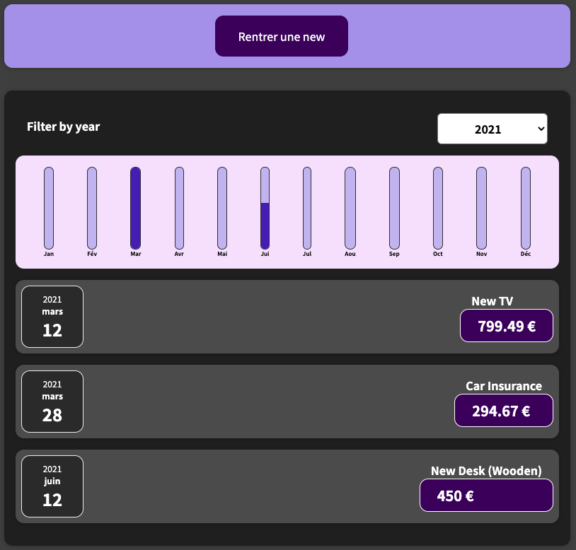

# react-expense-tracker

A local expense tracker with chartbars made in react.js

## To run :

1. Clone de repo
2. Run `npm install` to install all the dependencies of the project
3. Go to **localhost:3000** and enjoy
